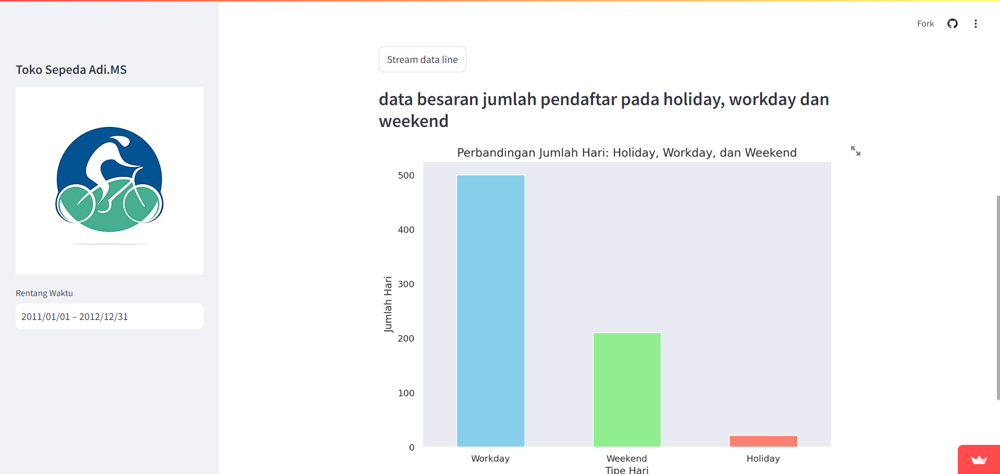

# Pengumpulan Tugas Akhir Analisa Data

Nama : I Kadek Adi Memes Subagia

Haii, Pada kesempatan kali ini saya membuat dashboard dengan streamlit, menggunakan studi kasus data penyewa sepeda yang sudah disediakan  
dalam studi kasus ini saya memulai dengan mengumpulkan data yang dibutuhkan, memeriksa data jika ada kesalahan pada nilai, type data maupun ada data yang duplikat  
setelah itu saya membuat visualisasi dari data untuk menjawab pertanyaan bisnis yang ada, yaitu membuat rekapan grafik yang memperlihatkan tren penyewaan sepeda dalam bulan  
dan juga membuat perbandingan penyewaan sepeda di hari libur, kerja dan weekend.

## Pertanyaan Bisnis 

<ol>
    <li>bagaimana peningkatan jumlah register sepeda setiap bulannya</li>
    <li>perbandingan jumlah register Holiday, workingday, dan weekday</li>
</ol>

dalam project yang saya buat untuk pertanyaan ini sudah saya jawab pada file Notebook.ipnyb  
dengan menambahkan visual yang bisa dibaca oleh orang lain.

## Cara menjalankan Dashboard

Disini saya juga membuat sebuah dashboard yang berisikan hasil study kasus yang saya buat.  
saya membuat dashbiar tersebut dengan tools yaitu streamlit  

disini saya sudah membuatnya dan deploy intuk bisa dilihat orang lain, untuk cara menjalankannya bisa membuka file url.txt  
karena sudah berisikan link dashboard streamlit yang sudah saya deploy.  

### Dokumentasi Dashboard

  

